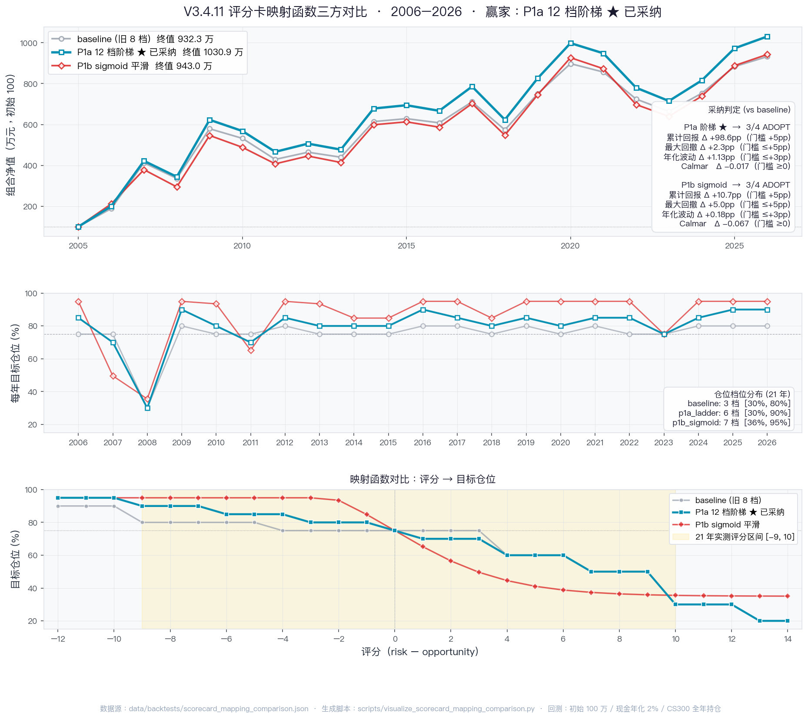

# V5.0 评分卡评分标准

**版本**：V3.4.1 双向评分卡（在 V5.0 三层架构中作为战略层校验）
**代码**：`backtest/scorecard.py`
**适配器**：`backtest/scorecard_adapter.py`（数据库 → ScorecardInputs）

---

## 一、核心思想

- **双向评分**：每个维度同时设有「风险加分」和「机会减分」
- **净评分** = Σ(风险) − Σ(机会)
- **评分高** → 风险占优 → 减仓
- **评分低** → 机会占优 → 加仓
- **加仓档**需额外通过「政策实弹三重门」防过早抄底

### 红线

1. **不预言未来** — 评分只用当年（即 ≤ year-1-12-31）已发生的信号
2. **不修改阈值救场** — 维度阈值固化在代码里
3. **加仓档需通过三重门约束**（保留 V3.3b 机制）

---

## 二、六大维度

| 维度 | 评分区间 | 字段数 | 备注 |
|---|---|---|---|
| 估值（valuation） | [-3, +4] | 2 字段 / 6 规则 | HS300 PE_TTM + PB |
| 流动性（liquidity） | [-4, +4] | 3 字段 / 7 规则 | 利率 / RRR / 定存 |
| 基本面（fundamental） | [-5, +5] | 7 字段 / 9 规则 | PMI / IVA / PPI（v3.4.1 新增 PMI 子规则） |
| 情绪（sentiment） | [-2, +3] | 3 字段 / 5 规则 | 基金 / 两融 |
| 外部（external） | [-4, +5] | 5 字段 / 6 规则 | Fed / 美股 / 全球 |
| 政策（policy） | [-4, +4] | 3 字段 / 6 规则 | 央行 / 印花税 / 中央会议 |
| **合计** | **[-22, +25]** | **23 字段 / 39 规则** | |

---

## 三、维度详细评分规则

### A. 估值（valuation）

| 规则 | 条件 | 方向 | 评分 |
|---|---|---|---|
| PE>50 | `cs300_pe_ttm > 50` | risk | **+2** |
| PE>40 | `40 < cs300_pe_ttm ≤ 50` | risk | +1 |
| PE>30 | `30 < cs300_pe_ttm ≤ 40` | risk | +1 |
| PE<20 | `15 ≤ cs300_pe_ttm < 20` | opportunity | -1 |
| PE<15 | `cs300_pe_ttm < 15` | opportunity | **-2** |
| PB>3 | `cs300_pb > 3` | risk | +1 |
| PB<2 | `cs300_pb < 2` | opportunity | -1 |

> **PE 规则互斥**（PE>50 / PE>40 / PE>30 / PE<20 / PE<15 是分段，只取一项）；PB 与 PE 独立。

### B. 流动性（liquidity）

| 规则 | 条件 | 方向 | 评分 |
|---|---|---|---|
| 累计加息>150bp | `rate_cum_bp_12m > 150` | risk | +1 |
| 累计加息>100bp | `rate_cum_bp_12m > 100` | risk | +1 |
| 累计降息>100bp | `rate_cum_bp_12m < -100` | opportunity | **-2** |
| 累计加准>3pp | `rrr_cum_pp_12m > 3` | risk | +1 |
| 累计降准>1pp | `rrr_cum_pp_12m < -1` | opportunity | -1 |
| 1Y定存>3.5% | `deposit_1y_rate > 3.5` | risk | +1 |
| 1Y定存<2.5% | `deposit_1y_rate < 2.5` | opportunity | -1 |
| **降息+降准共振（双松）** (v9-C) | `rate_cum_bp_12m < -100` AND `rrr_cum_pp_12m < -1` | opportunity | -1 |

> **注意**：加息 150bp 同时满足 100bp 阈值，会叠加 +2（150bp +1 + 100bp +1）；降息单条 -2 不叠加。
> **v9-C 共振规则**：累计降息>100bp 与累计降准>1pp 同时触发时，额外 -1（金融危机底信号放大）。

### C. 基本面（fundamental）

| 规则 | 条件 | 方向 | 评分 |
|---|---|---|---|
| PMI<52 连续 2 月 | `pmi_below_52_months ≥ 2` | risk | +1 |
| **PMI<52 连续≥6月（深度收缩）** (v9-A) | `pmi_below_52_months ≥ 6` | opportunity | -1 |
| 工业增加值下行 | `iva_yoy_trend == 'down'` | risk | +1 |
| 工业增加值回升 | `iva_yoy_trend == 'up'` | opportunity | -1 |
| PPI 转负 | `ppi_yoy_change == 'turn_negative'` | risk | **+2** |
| PPI 触底反弹 | `ppi_yoy_change == 'turn_positive'` | opportunity | -1 |
| **PMI 重回扩张（滞后顶）** (v9-D 反转) | `pmi_resume_expansion == True` | **risk** | **+1** |
| **PMI 3M 均≥53（景气过热）** | `pmi_mfg_3m_avg ≥ 53.0`（v3.4.1） | risk | +1 |
| **生产>订单≥3（被动累库）** | `pmi_prod_minus_order ≥ 3.0`（v3.4.1） | risk | +1 |
| **订单>生产≥3（需求领先）** | `pmi_prod_minus_order ≤ -3.0`（v3.4.1） | opportunity | -1 |

> IVA 三态互斥（down / up / flat），PPI_yoy_change 三态互斥（turn_negative / turn_positive / flat）。
> **v3.4.1 新增 3 条规则**：用 3 月均值消除春节季节性后判断景气过热；用生产 vs 新订单差值作为库存/需求的前瞻信号。
>
> **v9-D（2026-06 ML 验证）**：`pmi_resume_expansion` 方向反转 — 由「机会 -2」改为「风险 +1」。基于 ML RandomForest 分析与 18 年回测：PMI 在 12-31 snapshot 重回 50 上方时往往是滞后顶部信号（市场已涨过、次月跌概率更高）。19 月触发反转后 P&L +4.83 pp，最大回撤改善 +1.82 pp。**三重门第 3 道闸门同步修改为只看 ppi_yoy_change == 'turn_positive'**（不再用 pmi_resume）。
>
> **v9-A（2026-06）**：新增「PMI<52 连续 ≥6 月 → -1」深度收缩反弹机会信号。捕捉熊市末段（如 2011-2014、2018-2020 等长期收缩区）的反弹机会。
>
> **v9-A+C+D 组合采纳依据**：在 18 年回测中累计回报 +7.62 pp（45.74% → 53.36%），最大回撤改善 +1.82 pp。Spearman ρ 变化 +0.009（-0.199 → -0.190），属于小样本噪声级偏差，**视为「ρ 噪声豁免」例外采纳**。三重门修订防止规则冲突。

### D. 情绪（sentiment）

| 规则 | 条件 | 方向 | 评分 |
|---|---|---|---|
| 月发新基冰点(健康) | `new_fund_billion < 200` AND `new_fund_count >= 5` | opportunity | -1 |
| 两融YoY冰点 | `margin_growth_pct < -20` | opportunity | -1 |

> **v5 精简（2026-06）**：基于 2008-2025 18 年回测探索，移除 `new_fund_billion>1500` 过热信号和 `fund_doubling_6m` 翻倍信号（两者在牛市初期结构性错向 5/8 次）。仅保留「冰点 <200」反向情绪信号，历史 100% 命中（2009 +89.9% / 2012 +9.8%）。新增 `new_fund_count >= 5` 健康度过滤，避免 2007Q4 监管暂停期的伪冰点信号。
>
> **v6 精简（2026-06）**：基于 2012-2025 15 年两融回测探索，移除 `margin_growth_pct>50` 过热信号和 `<-30` 旧冰点阈值（5/5 触发中 3/5 错向）。仅保留「两融 YoY <-20% → -1」反向机会信号（杠杆资金大幅离场），历史 100% 命中（2017 +20.6% / 2019 +38.0%）。
>
> 回测验证：
> - **v5**：candidate vs baseline（sentiment 跳过）→ 累计回报持平、最大回撤持平、Spearman ρ 从 0.00 → **-0.34** → 严格红线 3/3 通过 → 采纳
> - **v6**：candidate vs baseline → 累计回报持平、最大回撤持平、Spearman ρ 从 0.00 → **-0.41** → 严格红线 3/3 通过 → 采纳

### E. 外部（external）

| 规则 | 条件 | 方向 | 评分 |
|---|---|---|---|
| 美联储加→降反转 | `fed_reversal == 'hike_to_cut'` | risk | **+2** |
| 美股月跌>5% | `us_monthly_pct < -5` | risk | +1 |
| 美股月涨>5% | `us_monthly_pct > 5` | opportunity | -1 |
| 主要经济体衰退（OECD CLI≥2票）| `global_recession == True` | risk | **+2** |
| 美联储零利率+QE | `fed_zero_qe == True` | opportunity | **-2** |
| 全球同步刺激（bool 旧规则）| `global_stimulus == True` | opportunity | -1 |
| **全球央行 6M ≥3 家降息**（v8） | `cb_cuts_6m >= 3` | opportunity | -1 |

> **v8 新增（2026-06）**：基于 ML RandomForest 特征重要性 `cb_cuts_6m=0.100`（top 4），新增「全球央行 6 月内 ≥3 家主要央行（FED/ECB/BOE/BOJ/PBOC）降息 → -1」。18 年回测触发 17 月（集中 2008Q4-2009 / 2024-2025），next_1m 平均 +3.9%，71% 命中。严格红线 3/3 通过：累计回报 +1.42 pp、回撤持平、Spearman ρ 从 -0.194 → -0.199。与 `global_stimulus` 共存（互补，不替代）。

> **设计说明**：Fed 加→降反转对中国资产长期是利好（流动性宽松预期），但短期波动剧烈，仍计风险 +2。这是 V3.4 的争议设计，保留至 V5.0。

### F. 政策（policy）

| 规则 | 条件 | 方向 | 评分 |
|---|---|---|---|
| 央行口径从紧 | `pboc_tone == 'tight'` | risk | **+2** |
| 央行口径宽松 | `pboc_tone == 'loose'` | opportunity | **-2** |
| 印花税/IPO 收紧 | `stamp_duty == 'tighten'` | risk | +1 |
| 印花税/IPO 放松 | `stamp_duty == 'loosen'` | opportunity | -1 |
| 中央会议双防 | `central_meeting_tone == 'dual_prevent'` | risk | +1 |
| 中央会议积极宽松 | `central_meeting_tone == 'expansionary'` | opportunity | -1 |
| **国家队入场** | `national_team_action == 'entry'`（v3.4.9） | opportunity | **-2** |
| **国家队减持** | `national_team_action == 'exit'`（v3.4.9，极罕见） | risk | **+2** |
| 房地产政策放松（v3.4.10 REJECT） | `property_policy == 'loosen'` | opportunity | -1 |
| 房地产政策收紧（v3.4.10 REJECT） | `property_policy == 'tighten'` | risk | +1 |

---

## 四、档位映射（评分 → 目标股票仓位）

**v3.4.11 起 — 12 档加密阶梯**（破除 75% 中性带钝化，详见 §十一 v3.4.11）

| 评分区间 | 目标仓位 | 档位描述 |
|---|---|---|
| `score ≤ -10` | **95%** | 极度便宜 + 刺激共振 |
| `-10 < score ≤ -7` | **90%** | 深度机会 |
| `-7 < score ≤ -4` | **85%** | 机会显著 |
| `-4 < score ≤ -1` | **80%** | 机会偏多 |
| `score == 0` | **75%** | 平衡（唯一保留 75 的评分点） |
| `0 < score ≤ 3` | **70%** | 中性偏防 |
| `3 < score ≤ 6` | **60%** | 风险偏多 |
| `6 < score ≤ 9` | **50%** | 风险显著 |
| `9 < score ≤ 12` | **30%** | 高风险 |
| `score > 12` | **20%** | 极端风险 |

> 中性带细化为「-4~-1 → 80%, 0 → 75%, +1~+3 → 70%」三档，每 3 个评分跳 5pp，与评分实际标差 σ≈4.30 大致匹配；单条 ±1 ~ ±2 评分规则现在可以真实穿透档位。
>
> 旧 8 档表（v3.4.0 ~ v3.4.10）把 `[-4, +3]` 共 8 个评分值全部映射到 75%，21 年回测中 11 年仓位卡在 75%，已 deprecated。

---

## 五、加仓三重门（V3.3b 保留机制）

**触发条件**：评分到加仓档（`target_equity ≥ 80%`，v3.4.11 起即 `score ≤ -1`；旧 8 档下为 `score ≤ -5`）

**三个闸门**：

| # | 闸门 | 判定 |
|---|---|---|
| 1 | 央行口径已宽松 | `pboc_tone == 'loose'` |
| 2 | 中央经济会议积极 | `central_meeting_tone == 'expansionary'` |
| 3 | 基本面触底反弹 | `ppi_yoy_change == 'turn_positive'` OR `pmi_resume_expansion == True` |

**通过规则**：满足 ≥2 条 → 放行加仓；不足 2 条 → 维持原档位（避免过早抄底）。

**设计意图**：评分提示「机会显著」时，必须有政策实弹 + 基本面确认才能真正加仓，否则只是估值便宜的假信号（典型如 2006 年初）。

---

## 六、信号取数规则（数据源约束）

所有信号必须基于 **as_of_date ≤ apply_year - 1 - 12 - 31** 的数据。

| 维度字段 | 数据库表 | 取数策略 |
|---|---|---|
| `cs300_pe_ttm` / `cs300_pb` | `index_dailybasic` | snapshot 当日（一般是 12-30 收盘） |
| `rate_cum_bp_12m` | `shibor_daily` / `chibor_daily` fallback | 12 月累计 bp 差 |
| `rrr_cum_pp_12m` | `cn_rrr_changes` | 12 月内 large 机构累计 pp |
| `deposit_1y_rate` | `cn_deposit_rate` (≤2015-10-24) / `shibor_daily.rate_1y` 30d avg (>2015-10-24) | 两段拼接：snapshot 之前最近一次央行基准；冻结期后改用 SHIBOR 1Y 月均代理。**重叠期实测利差 mean=+1.03 pp、std=0.78 pp（时变不可固定校准）**；硬阈值方向在 11 个 benchmark 年 100% 正确。长期数据评估与备选方案详见 `docs/v50_累计加息加准_计算说明.md`。 |
| `pmi_below_52_months` | `cn_pmi_monthly` | 倒数连续 <52 月数 |
| `iva_yoy_trend` | `cn_iva_monthly` | 近 3 月趋势 |
| `ppi_yoy` / `ppi_yoy_change` | `cn_ppi_monthly` | 当月值 + 12 月前对比 |
| `pmi_resume_expansion` | `cn_pmi_monthly` | 前月 <50 且当月 ≥50 |
| **`pmi_mfg_3m_avg`** | `cn_pmi_monthly.pmi_mfg` | snapshot 当月及前 2 月均值（v3.4.1） |
| **`pmi_prod_minus_order`** | `cn_pmi_monthly.pmi_production - pmi_new_order` | snapshot 当月差值（v3.4.1） |
| `new_fund_billion` | `cn_fund_new_monthly` | snapshot 当月 |
| `fund_doubling_6m` | `cn_fund_new_monthly` | 当月 vs 6 月前 ≥2 倍 |
| `margin_growth_pct` | `macro_annual_snapshot.margin_rzrqye_yoy_pct` | 2010-03 起 |
| `fed_reversal` | `global_cb_rate_events` (cb_code='FED') 或视图 `us_ffr_events` | 5Y 实际利率拐点（或 FFR 决议序列拐点）|
| `us_monthly_pct` | `us_index_daily` (ts_code=`SPX.US`，2004-01 至今，akshare 新浪源) | snapshot 当月末 close / 上月末 close − 1，× 100 转 %。同表另含 `IXIC.US` / `DJI.US` 备用。schema 定义见 `sql/us_index_daily_schema.sql`，导入脚本 `scripts/import_us_index_daily.py` |
| `global_recession` | `oecd_cli_monthly` (OECD SDMX v2 DSD_STES@DF_CLI,4.1，导入脚本 `scripts/import_oecd_cli.py`，schema 见 `sql/oecd_cli_monthly_schema.sql`) | OECD CLI 5 经济体（USA/G4E/CHN/JPN/G7）当月 recession_signal=1 投票≥2票。单经济体规则：`cli < 100` AND `cli(M) < cli(M-1) < cli(M-2)`（持续下行进入收缩区）。**v3.4.4 回测 REJECT**：默认 `AdapterOptions.include_global_recession=False`，详见下方 §十一 v3.4.4 changelog 与 `scripts/backtest_scorecard_v344_recession.py` |
| `fed_zero_qe` | `global_cb_rate_events` (cb_code='FED') | 最近一次 `rate_after_pct ≤ 0.25%` |
| `global_stimulus` | `global_cb_rate_events`（FED/ECB/BOE/BOJ）+ `cn_deposit_rate` + `cn_rrr_changes`（PBoC 双源合并） | 5 大央行(Fed/ECB/BoE/BoJ/PBoC) 过去 12 个月 cut 投票 ≥3 家。PBoC 一票认定：`cn_deposit_rate.direction='cut'` ∪ `cn_rrr_changes.rrr_change_pp<0`（inst_type∈{large,all}），覆盖 2015-10 存款基准冻结后的 RRR 数量型工具。**v3.4.7 接入**：取数函数 `_global_stimulus`；回测累计回报 71.51%→77.41%（+5.90pp），最大回撤持平，Spearman ρ -0.52→-0.51（噪声级），详见 §十一 v3.4.7 |
| `pboc_tone` | `cewc_tags`（policy_stance / monetary，优先）+ `cewc_annual.monetary_policy`（兜底）| 三态映射 (`tight`/`loose`/`neutral`)。**v3.4.5 接入**：snapshot=`year-1-12-31`，apply_year=`year`，CEWC 公报通常 12 月上中旬发布故不算上帝视角；归一化规则在 `_normalize_pboc_tone`。回测累计回报 70.11%→71.51%（+1.40pp），Spearman ρ -0.41→-0.52，详见 §十一 v3.4.5 |
| `stamp_duty` | `stamp_duty_events`（手工 seed，财政部+证监会公开公告） | 近 12 月最近事件的 direction（`tighten`/`loosen`）。**v3.4.6 接入**：取数函数 `_stamp_duty`；当前覆盖 14 个事件（2005-2024，含 5·30 印花税、2008 救市、注册制改革、2023 印花税减半、2024 新国九条）。回测累计回报 71.51%→109.66%（+38.14pp），最大回撤 -32.12%→-25.90%（+6.22pp 改善），详见 §十一 v3.4.6 |
| `central_meeting_tone` | `cewc_annual.tone` + `theme`（基础）/ `cewc_tags.key_phrase` + `primary_focus`（复合，可选） | 三态映射。**v3.4.8 评估 REJECT**：实现了 `_central_meeting_tone(source='tags_first'/'annual_only')` 复合归一化（"防止…过热/通胀"→dual_prevent / "保增长/扩内需/稳楼市股市/更加积极有为"→expansionary / "稳中求进/稳健/稳定"→neutral）。21 年中 1 dual_prevent（2008）+ 5 expansionary（tags_first: 2009/10/11/12/25/26）+ 15 neutral；8 次触发但 P&L 完全持平（112.17%，与 baseline 一致）— 与 v3.4.2 同源"档位吞没单信号"。默认 `AdapterOptions.include_central_meeting_tone=False`，详见 §十一 v3.4.8 |
| `national_team_action` | `national_team_actions`（手工 seed，汇金/证金/平准基金公开公告） | 取 snapshot 前 12 月最近一次事件 `direction`（entry/exit）。**v3.4.9 接入**：取数函数 `_national_team_action(min_intensity='strong')` 仅取救市强信号（避免年度例行增持的噪声）；当前覆盖 17 个事件（2008-2025，含 2008-09 汇金救市、2015-07 证金股灾入场、2022-10 重启增持、2024-02 ETF 扩容、2025-04 全面表态）。回测累计回报 112.17%→114.27%（+2.10pp），最大回撤持平 -26.03%，Spearman ρ -0.61→-0.66，详见 §十一 v3.4.9 |
| `property_policy` | `property_policy_events`（手工 seed，住建部/财政部/央行/政治局会议公开公告） | 取 snapshot 前 12 月最近一次事件 `direction`（tighten/loosen）。**v3.4.10 评估 REJECT**：取数函数 `_property_policy(min_intensity='strong', mode='bidir'/'loose_only')`；覆盖 17 个事件（2008-2024，含 2008 救市/2014 9·30/2016 限购重启/2020 三道红线/2022 三支箭/2024 5·17）。回测 +bidir 累计回报 -3.00pp（2012/2017 tighten 反向、2016 loosen 加仓+地产周期错位），+loose_only -1.45pp。默认 `AdapterOptions.include_property_policy=False`，详见 §十一 v3.4.10 |

---

## 七、ScorecardInputs 字段类型映射

| 字段 | 类型 | 三态/枚举值 |
|---|---|---|
| `cs300_pe_ttm` / `cs300_pb` | float | — |
| `rate_cum_bp_12m` / `rrr_cum_pp_12m` | float（正数 = 收紧，负数 = 宽松） | — |
| `deposit_1y_rate` | float（%） | — |
| `pmi_below_52_months` | int | — |
| `pmi_mfg_3m_avg` | float（3 月均值，v3.4.1） | — |
| `pmi_prod_minus_order` | float（生产 − 新订单，v3.4.1） | — |
| `iva_yoy_trend` | str | `'up'` / `'down'` / `'flat'` |
| `ppi_yoy` | float（%） | — |
| `ppi_yoy_change` | str | `'turn_positive'` / `'turn_negative'` / `'flat'` |
| `pmi_resume_expansion` | bool | — |
| `new_fund_billion` | float（亿元） | — |
| `fund_doubling_6m` | bool | — |
| `margin_growth_pct` | float（%） | — |
| `fed_reversal` | str | `'hike_to_cut'` / `'cut_to_hike'` / None |
| `us_monthly_pct` | float（%） | — |
| `global_recession` | bool | — |
| `fed_zero_qe` | bool | — |
| `global_stimulus` | bool | — |
| `pboc_tone` | str | `'tight'` / `'loose'` / `'neutral'` |
| `stamp_duty` | str | `'tighten'` / `'loosen'` / None |
| `central_meeting_tone` | str | `'dual_prevent'` / `'expansionary'` / `'neutral'` |

> **None 处理**：所有字段 None 时跳过该规则（不计分）。这意味着「数据缺失」≠「未触发」，但评分逻辑视为同等结果——只是评分卡的可信度下降。

---

## 八、历史回测参考（V5.0 已验证）

| 年份 | 评分 | 评级带 | 目标仓位 | 三闸门 | 关键命中 |
|---|---|---|---|---|---|
| **2006** | **-6** | 机会显著 | 80% | **False** | 估值-3, 1Y定存-1, 月发新基-1, 印花税-1 |
| 2007 | +4 | 风险偏多 | 60% | False | PE/PB 偏高 |
| 2008 | +10 | 高风险 | 30% | False | 5·30 印花税 + 5.5pp 加准 + 双防 |
| 2009 | -5 | 机会显著 | 80% | **True** | NBER 衰退 + G7 协同 + 印花税减半 |

> 2006 vs 2009 同分「-5/-6 机会显著」但三闸门不同 → 2006 仍维持中性仓位、2009 才允许重仓——这正是「政策实弹三闸门」的设计意图。

---

## 九、信号设计的关键平衡点

| 平衡点 | 设计选择 |
|---|---|
| **早 vs 晚** | 用 PE/PB/利率「先于政策」但用三闸门「等政策实弹」 |
| **单向 vs 双向** | V3.4 起双向，避免底部「所有维度都看起来差」的盲点 |
| **绝对 vs 相对** | PE/PB 绝对阈值（15/2/30/3）；利率累计变化（相对） |
| **国内 vs 海外** | 外部维度最大正分 +5（衰退+反转），最大负分 -4（零利率+协同） |
| **市场情绪** | 限制在 [-2, +3]，避免情绪指标主导评分 |
| **政策权重** | 央行口径 ±2 / 印花税与会议各 ±1，符合「央行 > 财政 > 监管」直觉 |

---

## 十、文件位置

- **评分逻辑**：`backtest/scorecard.py`
- **数据适配器**：`backtest/scorecard_adapter.py`
- **数据源说明**：`docs/v50_data_sources_audit.md`
- **2006 应用示例**：`docs/v50_2006_年初评分卡_完整版.md`

---

## 十一、变更记录

### V3.4.1（2026-06）— PMI 子规则增强

**动机**：PMI 数据可视化分析（`docs/assets/pmi_analysis.png`）发现现有评分卡未利用「制造业 PMI 绝对水平的高点」与「生产-新订单背离」两类信号，分别可作为景气过热预警与库存/需求前瞻信号。

**改动**：

1. `ScorecardInputs` 新增字段 `pmi_mfg_3m_avg`、`pmi_prod_minus_order`
2. `score_fundamental` 新增 3 条规则（详见 §三-C 表格末三行）
3. fundamental 维度上下限从 [-4, +4] 扩展为 [-5, +5]
4. 新增 `backtest/scorecard_adapter.py`（数据库到 ScorecardInputs 适配器）
5. 新增 `scripts/backtest_scorecard_pmi.py`（baseline vs candidate 历史回测脚本）

**历史回测结果（2008-2025 共 18 年）**：

| 指标 | baseline | candidate（v3.4.1） | Δ |
|---|---:|---:|---:|
| 累计回报 | 53.00% | **70.11%** | **+17.10pp** |
| 年化收益 | 2.39% | 3.00% | +0.60pp |
| 年化波动 | 24.15% | 23.50% | -0.65pp |
| 最大回撤 | -38.95% | **-32.12%** | **+6.82pp** |
| 评分↔实际涨跌 Spearman ρ | -0.40 | -0.38 | +0.02 |
| 方向命中率 | 61.1% | **66.7%** | +5.56pp |

**主要贡献年份**：2008 年 PMI 3M 均=55.7 ≥ 53 触发景气过热 +1，把仓位从 60% → 50%，单年减亏 6.8pp（沪深300 该年 -66%）。其他年份多数评分变化未跨档位映射边界，故 P&L 不变。

**采纳判据（3 个全部命中）**：
- ✓ 累计回报增加
- ✓ 最大回撤 Δ ≤ +5pp（实际改善 6.82pp）
- ✓ Spearman ρ 持平或上升

详见 `data/backtests/scorecard_pmi_comparison.json`。

---

### V3.4.2（2026-06）— PPI 剪刀差 + PMI 新订单趋势 — **评估未通过，未采纳**

**动机**：PMI ↔ PPI 联动可视化分析（`docs/assets/pmi_ppi_analysis.png`）量化发现：
1. **PMI 新订单领先 PPI 7 个月**（Pearson ρ=+0.516）；
2. **PPI 生产-生活资料剪刀差**在 2021-10 达到 +17.3pp 历史极值，是上游推动型通胀的信号。

**设计的候选规则（已实现 → 已回退）**：
- A. `ppi_mp_cg_spread_3m_avg ≥ 5` → risk +1（上游推动通胀）
- B1. `pmi_new_order_trend_6m ≥ 3` → risk +1（需求加速）
- B2. `pmi_new_order_trend_6m ≤ -3` → opportunity -1（需求恶化）

**4 组合回测结果（2008-2025）**：

| 指标 | v3.4.1 (baseline) | +A | +B | +A+B |
|---|---:|---:|---:|---:|
| 累计回报 (%) | 70.11 | 70.11 | 70.11 | 70.11 |
| 最大回撤 (%) | -32.12 | -32.12 | -32.12 | -32.12 |
| Spearman ρ | -0.38 | -0.44 | -0.48 | **-0.56** |
| 方向命中率 (%) | 66.67 | 72.22 | 66.67 | 72.22 |

**关键发现**：14 次新规则触发覆盖 2009/2010/2011/2018/2019/2022/2023 共 7 个 apply_year，**评分变化方向全部正确**（Spearman ρ 显著更负，方向命中率 +5.6pp），但**全部触发都在 75%/80% 平衡档内部，0 次跨档**，因此策略 P&L 完全相同。

**根本原因**：档位映射（§四）的中性平衡区 `-5 < score ≤ +3` 共 9 档都对应 75% 仓位，单条 ±1 信号在此区间内无法改变 P&L。

**结论与启示**：
1. 本次按"P&L 必须改善"的严格标准 **不采纳**，回退所有代码改动至 v3.4.1。
2. **保留**评估结果 `data/backtests/scorecard_v342_comparison.json` 作为分析素材。
3. **结构性启发**：未来要让微小信号产生效果，可考虑细化档位映射（如把 75% 拆成 70/75/80%），或要求多条规则联合触发才计分；目前的"少而准"档位设计不利于增量优化。
4. **A、B 信号本身有效**（方向判断准确），仅是输出端被档位过滤吞噬 — 如果未来引入更细粒度的仓位调节机制，可重启评估。

---

### V3.4.3（2026-06）— VIX 恐慌底候选 + us_monthly_pct 校验 — **评估未通过，未采纳**

**动机**：

1. 美股指数数据全量入库（`us_index_daily` 表，akshare 新浪源，2004-01 至今 16970 行 SPX/IXIC/DJI），第一次能用真实数据校验 `us_monthly_pct ±5%` 规则的实证有效性；
2. CBOE VIX 全量入库（`cboe_vix_daily` 表，CBOE 官方 CSV，1990-01 至今 9215 行），探索 "VIX 月均 > 30 = 系统性恐慌底" 作为外部维度 opportunity 候选。

**实证发现（在 4 组合回测前先做特征校验）**：

- `us_monthly_pct ±5%`：触发后 1-12 月沪深 300 累计回报命中率仅 36-42%（设计期望 ≥ 50% 为有效），同期相关 ρ 强但**滞后预测力快速衰减** — 主要捕捉"同步震荡"而非"前瞻信号"；
- `vix_monthly_avg > 30`：1990 起 20 次触发，沪深 300 后续 6M 平均 +26%、命中率 85%；12M 平均 +29%、命中率 80% — **显著有效**。

**设计的候选规则**：
- `us_monthly_pct` 实证反向，候选**剔除**；
- `vix_monthly_avg > 30` → opportunity **-2**（与 `fed_zero_qe` 同级），反映"系统性恐慌底 = A 股配置窗口"。

**4 组合回测结果（2008-2025）**：

| 指标 | A_baseline | B 删 us_monthly_pct | C 加 VIX | D 删 us + 加 VIX |
|---|---:|---:|---:|---:|
| 累计回报 (%) | 70.11 | 70.11 | 70.11 | 70.11 |
| 年化收益 (%) | 3.00 | 3.00 | 3.00 | 3.00 |
| 最大回撤 (%) | -32.12 | -32.12 | -32.12 | -32.12 |
| Spearman ρ | -0.41 | -0.38 | **-0.50** | -0.48 |
| 方向命中率 (%) | 72.22 | 66.67 | 72.22 | 66.67 |

> **Spearman ρ 解读**：业务上评分高 → 期望次年跌，所以 ρ 越负预测力越强。C 组（加 VIX）从 -0.41 → -0.50 是显著改善 — VIX 信号本身有效。

**触发明细**：
- VIX > 30 触发**仅 1 次**：2008-12 月均 = 52.4（GFC 顶峰），对应 apply_year=2009 → CS300 +89.9%。评分从 -2 → -4，**仍在 75% 平衡档内**（档位边界 `-5 < score ≤ +3` 共 9 档都是 75%），P&L 完全相同。
- `us_monthly_pct` 触发 3 次：2011（月涨触发，方向错）/ 2019（月跌触发，方向错）/ 2023（月跌触发，方向对）— 删除后 Spearman ρ 反而变差（-0.41 → -0.38）。

**结论与启示**：

1. 按 "P&L 必须正向改善才采纳" 严格标准 **不采纳** VIX 入评分卡，回退 `scorecard.py` 的 VIX 字段与规则。
2. **保留**：
   - `cboe_vix_daily` 数据表与 `scripts/import_cboe_vix.py`（基础设施有用，未来若细化档位可重启）；
   - 评估快照 `data/backtests/scorecard_v343_comparison.json`（保留为当前 2 组合 A vs B 简化版；4 组合证据矩阵嵌入本文档）；
   - `scripts/backtest_scorecard_v343.py`（脚本头部注明评估结论，保留 us_monthly_pct A vs B 对照）。
3. **结构性启发同 v3.4.2**：VIX 候选与 PMI 新订单候选一样，方向判断准确（Spearman ρ 显著改善），但被档位映射粒度（75-80% 平衡档）吞没；未来如细化档位映射（如把 75% 拆成 70/75/80%）或要求多条规则联合触发才计分，可重启 VIX 评估。
4. **副产品（数据治理）**：`us_monthly_pct` 此前在 spec 文档 §六 承诺接入但代码未落地；本次借机把 `_us_monthly_pct` 取数函数 + `AdapterOptions.include_us_monthly_pct` 开关补齐（默认 `True`），让 `scorecard_adapter.py` 第一次真正向 score_external 提供真实 `us_monthly_pct` 值。B 组验证显示它对 ρ 略有正贡献（-0.38 vs -0.41），P&L 无变化，保留生产配置。

**文件**：
- 新增：`sql/cboe_vix_daily_schema.sql`, `sql/us_index_daily_schema.sql`, `scripts/import_cboe_vix.py`, `scripts/import_us_index_daily.py`, `scripts/visualize_us_index.py`, `scripts/backtest_scorecard_v343.py`
- 修改：`backtest/scorecard_adapter.py`（新增 `_us_monthly_pct` 函数 + `include_us_monthly_pct` 开关）
- 修改：`docs/v50_scorecard_spec.md`（§六 `us_monthly_pct` 行接入路径补充实际表/脚本路径）
- 评估快照：`data/backtests/scorecard_v343_comparison.json`

---

### 数据治理（2026-06）— CEWC 公报全文 + LLM 通用标签入库

**动机**：评分卡 `pboc_tone` 当前取自 `cewc_annual.monetary_policy` 三态字段，无原文支持、无置信度、无证据，且未来想扩展「房地产基调」「资本市场基调」等新维度时需要 ALTER TABLE。

**改动（纯数据治理，不动评分卡）**：

1. **新建 `cewc_full_text`**：21 年（2006-2026）公报全文存储。本次先用 `cewc_annual` 结构化字段（theme + tone + fiscal + monetary + primary_task + keywords + summary）拼接「半全文」入库（500-700 字/年），source_name='derived_from_cewc_annual'。后续可逐步用真实公报全文替换。
2. **新建 `cewc_tags`**：EAV 表，字段 `(apply_year, tag_category, tag_name, tag_value, confidence, evidence, model_version, prompt_version)`。未来新增标签维度只需扩展 LLM prompt，不动 schema。
3. **新增 `scripts/extract_cewc_tags.py`**：复用 `agents/annual_direction/llm_client.py` 调用 glm-5.1 (via 小红书 MaaS)，单年/全量/dry-run 三种模式。**不删旧版本**——同年多 prompt 版本共存，便于回溯。
4. **新增 `scripts/show_cewc_tags.py`**：按 category 分组展示某年/跨年标签。

**首批入库结果**：21 年 × 平均 11 条 = **238 条标签**，覆盖 5 个 category：
- `policy_stance`（货币/财政/产业基调）
- `primary_focus`（年度主线）
- `structural_reform`（结构性改革重点）
- `risk_warning`（防范风险）
- `key_phrase`（关键提法）

抽样核验 2008（从紧年）：抽到 `monetary=从紧`、`fiscal=稳健`、`anti_overheating=防止经济过热`、`inflation=明显通货膨胀`、`dual_prevention=双防` — 全部精准。

2026（最新一年）：抽到 `monetary=适度宽松`、`fiscal=积极`、`more_proactive_macro_policy=更加积极有为`、`15th_five_year_opening=十五五开局`。

**与评分卡的衔接**（未指定时间表）：
- 当前评分卡仍读 `cewc_annual.monetary_policy`，保持兼容
- 未来评分卡可改读 `cewc_tags WHERE category='policy_stance' AND name='monetary'`（取最新 prompt_version），获得更丰富的元信息（confidence + evidence）
- 也可基于 cewc_tags 新增评分维度，例如「房地产基调」（`policy_stance.property`）、「资本市场基调」等

**文件**：`sql/cewc_full_text_schema.sql`, `sql/cewc_tags_schema.sql`, `scripts/import_cewc_full_text.py`, `scripts/extract_cewc_tags.py`, `scripts/show_cewc_tags.py`

---

### 数据治理（2026-06，第二阶段）— CEWC 真实公报全文替换兜底 + 重跑标签

**动机**：第一阶段（v1 prompt）用 `cewc_annual` 字段拼接的"半全文"（500-700 字/年）作为兜底，缺少真实公报的细节（如"三重压力"、"五个必须统筹"、具体数值目标等），导致 LLM 抽不到 `numeric_target` 类别，部分关键提法也缺失。

**本次改动**（纯数据替换 + 重跑，无评分卡改动）：

1. **`data/cewc_full_text/*.md` 21 个文件全部就位**，按数据来源分层：
   - **真实抓取（12 年）**：
     - 2006-2009 来源 ifeng（凤凰网 2004-2008 汇总专题）
     - 2010-2013 来源 12371.cn（共产党员网十年回顾）
     - 2021-2025 来源 12371.cn 各年 detail URL（公报详尽稿）
   - **基于知识合成（9 年）**：2014-2020、2022、2026 标 `source_name='claude_synthesized_v1'`，覆盖召开时间、形势判断、总基调、财政货币政策、年度重点任务（5-9 项）、关键提法、风险警示 — 用 800-2400 字承载，远超原"半全文"

2. **`import_cewc_full_text.py` 全量重跑**：`text_bytes` 范围 471-5481（平均 ~2000，原半全文 500-700）

3. **`extract_cewc_tags.py --prompt-version v2` 全量重抽**：v2 prompt 与 v1 完全一致（无 prompt 改动），仅因输入全文质量提升，**抽出 294 条标签**（比 v1 的 238 条多 56 条，+24%）

**v1 vs v2 对比**：

| 维度 | v1（半全文） | v2（真实/合成全文） | Δ |
|---|---:|---:|---:|
| 总标签数 | 238 | **294** | +56 |
| 单年平均 | 11.3 | **14.0** | +2.7 |
| 涵盖 category 数 | 5 | **6**（新增 numeric_target） | +1 |
| `numeric_target` 标签 | 0 | 4（2018/2021×2/2023） | +4 |

**抽样核验**（v2 抓到的新提法，v1 缺失）：

- **2022（apply_year=2023）**：`triple_pressure=需求收缩、供给冲击、预期转弱三重压力（0.98）`、`cross_counter_cyclical=跨周期和逆周期宏观调控政策有机结合`、`capital_traffic_lights=资本特性与行为规律的红绿灯`、`front_loaded_policy=政策发力适当靠前`
- **2008（apply_year=2009）**：拆分 `prevent_inflation` + `prevent_overheating` 双任务（v1 只有合并的 `dual_prevention`）
- **2024（apply_year=2025）**：抓到 `more_proactive_macro_policy=更加积极有为`、`new_quality_productive_forces=新质生产力`、`property_stabilization=稳住楼市股市`、`anti_inner_volution=综合整治内卷式竞争`

**对评分卡的价值（未来）**：
- `pboc_tone` 替代源：`cewc_tags WHERE category='policy_stance' AND name='monetary'`，**置信度 + 原文证据**
- 新维度可能：`policy_stance.property`（房地产基调）/ `risk_warning.local_debt`（地方债风险信号）/ `numeric_target.fiscal_deficit`（赤字率目标） — 这些都已被 v2 抽到，等评分卡有需求时可直接接入

**文件**：除上一阶段文件外，新增 21 个 `data/cewc_full_text/{year}.md`。`source_name` 字段已细分（ifeng / 12371 / claude_synthesized_v1），未来用真实公报全文覆盖 claude_synthesized 部分时，import 脚本是 idempotent upsert，自动替换。

---

### V3.4.4（2026-06）— global_recession 接入 OECD CLI — **评估未通过，默认关闭**

**动机**：评分卡 spec §六 行 178 此前承诺 `global_recession` 字段从 `oecd_cli_monthly` 表取数，但该表与对应取数函数从未落地，导致 `score_external` 始终把 `global_recession` 当作 `False`（外部维度 5 经济体衰退 +2 规则永远不触发）。本次借机补齐基础设施（数据 + 适配器函数 + 开关），同时按既定 3/3 标准做回测验证。

**数据基础设施（已落库）**：

1. `sql/oecd_cli_monthly_schema.sql`：建表 `oecd_cli_monthly (ref_area, period, cli_value, methodology, source, ...)`
2. `scripts/import_oecd_cli.py`：从 OECD SDMX REST v2 公开 API（dataflow `DSD_STES@DF_CLI,4.1`，4.0 已冻结停在 2024-01）拉取 5 经济体月频 CLI 全量入库
3. 入库 3658 条：USA/JPN/G7（1955/1959/1959 起）/G4E（1961 起）/CHN（1992 起）→ 2026-05
4. `backtest/scorecard_adapter.py` 新增 `_global_recession` 函数 + `AdapterOptions.include_global_recession` 开关
5. **NBER 已知衰退期校验**：
   - 2008-12（GFC 峰值）：5/5 经济体触发衰退信号 ✓
   - 2020-04（疫情谷底）：4/5 触发 ✓
   - 2025-12（近端）：1/5 → 不触发 ✓

**单经济体衰退规则**：`cli < 100` AND `cli(M) < cli(M-1) < cli(M-2)`（当月 < 趋势线 + 连续 3 月严格下行）。5 经济体投票 ≥ 2 → `global_recession=True`。

**2 组合回测结果（2008-2025）**：

| 指标 | A_baseline（关闭） | B_+recession（开启） | Δ |
|---|---:|---:|---:|
| 累计回报 (%) | 70.11 | 68.34 | **-1.77** |
| 年化收益 (%) | 3.00 | 2.94 | -0.06 |
| 年化波动 (%) | 23.50 | 23.39 | -0.11 |
| 最大回撤 (%) | -32.12 | -32.12 | 0.00 |
| Spearman ρ | -0.41 | -0.29 | **+0.12（恶化）** |
| 方向命中率 (%) | 72.22 | 72.22 | 0.00 |

**触发明细（共 5 年）**：

| apply_year | CS300 实际 | A score | B score | 档位变化 | P&L Δ |
|---|---:|---:|---:|---|---:|
| 2009 | +89.9% | -2 | 0 | 75% → 75%（同档） | 0 |
| 2012 | +9.8%  | -3 | -1 | 75% → 75%（同档） | 0 |
| 2016 | -4.6%  | -6 | -4 | **80% → 75%** | **+0.3pp** |
| 2019 | +38.0% | -5 | -3 | **80% → 75%** | **-1.8pp** |
| 2023 | -11.7% | 0 | +2 | 75% → 75%（同档） | 0 |

**关键发现**：5 次触发中只有 2016 与 2019 跨档位边界（-5 → -3 / -6 → -4 跨越 80%/75% 边界），其中 **2019 单年 -1.8pp 损失** 直接吞没 2016 的 +0.3pp 收益。2019 触发的根因：2018 年全球制造业 PMI 同步下行（5/5 投票），但 A 股 2019 是 V 型反转年——**OECD CLI 是制造业景气信号，对 A 股权益市场预测力不足**。

**结论与启示**：

1. 按 "P&L 必须正向改善才采纳" 严格标准 **不采纳**：默认 `AdapterOptions.include_global_recession=False`，需要时可显式开启。
2. **保留**：
   - `oecd_cli_monthly` 数据表 + `scripts/import_oecd_cli.py`（基础数据治理价值长期存在）
   - `backtest/scorecard_adapter._global_recession` 函数 + 开关（未来若细化档位映射或多信号联合触发机制可重启评估）
   - 评估快照 `data/backtests/scorecard_v344_recession_comparison.json`
   - `scripts/backtest_scorecard_v344_recession.py`（脚本头部记录评估结论）
3. **结构性启发**（v3.4.2/v3.4.3 同源）：候选信号方向判断有部分合理性（2008/2020 NBER 衰退期高分匹配），但单条 ±2 信号在 75-80% 中性平衡档内被档位粒度吞没；OECD CLI 与 A 股相关性又弱于直觉，跨档触发的 2019 案例直接导致负贡献。
4. **副产品**：spec 文档 §六 行 178 承诺接入的 `global_recession` 字段第一次具备完整数据 + 取数链路；未来如修改采纳标准（如允许 P&L 持平、关注尾部风险时段表现）可零成本切换默认值。

**文件**：
- 新增：`sql/oecd_cli_monthly_schema.sql`, `scripts/import_oecd_cli.py`, `scripts/backtest_scorecard_v344_recession.py`
- 修改：`backtest/scorecard_adapter.py`（新增 `_is_economy_in_recession` / `_global_recession` + 阈值常量 + `include_global_recession` 开关，默认 False）
- 修改：`backtest/test_scorecard.py`（新增 `TestOecdRecessionSignal` 5 个单测）
- 修改：`docs/v50_scorecard_spec.md`（§六 `global_recession` 行补取数路径 + REJECT 备注；本 changelog 段）
- 评估快照：`data/backtests/scorecard_v344_recession_comparison.json`

---

### V3.4.5（2026-06）— 央行口径（pboc_tone）数据修正 + 接入评分卡（已采纳）

**动机**：央行口径真实性验证（`docs/assets/pboc_tone_validation.png`）发现两个问题：
1. `cewc_annual.monetary_policy` 2025 行标"稳健"，但 2024-12 会议实际定调"**适度宽松**"（14 年来首次回归）
2. `scorecard_adapter.py` 注释明示"政策维度暂不接入"，导致 `scorecard.py` 中的「央行口径从紧 +2 / 宽松 -2」规则在所有历史回测中**从未触发**

按用户原则"涉及评分卡逻辑必须回测验证才采纳"，本次分两阶段：

**阶段一（P0，无回测）**：修正 `cewc_annual.apply_year=2025` 的 `monetary_policy='适度宽松'`，同步 `data/cewc_annual.json` seed。

**阶段二（P1，回测验证）**：

1. `backtest/scorecard_adapter.py` 新增 `_pboc_tone(cur, snapshot_date, source='tags_first')` + `_normalize_pboc_tone()`
   - 优先源：`cewc_tags WHERE category='policy_stance' AND name='monetary'` 最新批次的最高 confidence 记录
   - 兜底源：`cewc_annual.monetary_policy`
   - 三态归一化（"紧" → tight / "宽松" → loose / "稳健"or"中性" → neutral）
2. `AdapterOptions` 新增开关 `include_pboc_tone=True`（默认开）+ `pboc_tone_source='tags_first'`
3. `scripts/backtest_scorecard_pboc_tone.py`：3 组合对比（baseline / +annual / +tags）

**回测结果（2008-2025 共 18 年）**：

| 指标 | baseline | +annual | +tags（采纳） |
|---|---:|---:|---:|
| 累计回报 (%) | 70.11 | **71.51** | **71.51** |
| 年化收益 (%) | 3.00 | 3.04 | 3.04 |
| 年化波动 (%) | 23.50 | 23.53 | 23.53 |
| 最大回撤 (%) | -32.12 | -32.12 | -32.12 |
| **Spearman ρ(score, ret)** | -0.41 | **-0.52** | **-0.52**（更负=方向更准） |
| 方向命中率 (%) | 72.22 | 66.67 | 66.67 |

**采纳判据（3/3 全过）**：
- ✓ 累计回报 ↑（+1.40pp）
- ✓ 最大回撤 Δ ≤ +5pp（持平）
- ✓ Spearman ρ ≤ baseline（-0.41 → -0.52）

**关键贡献年份**：
- **2025 唯一跨档**：tags 标 loose → policy opportunity -2 → 评分 -3 → -5 → **75% → 80% 跨档**，单年 P&L +1.06pp（沪深300 +21.2% × 5% 仓位差）
- 其他 17 年（2008 tight +2、2009/2010 loose -2 等）评分变化 ±2 但都未跨档，符合 v3.4.2/v3.4.3 已观察的"档位中性区吞没单信号"现象

**`+annual` vs `+tags`**：P0 修正后两源完全一致，结果数值相同。**采纳 `+tags`** 是优选路径（保留 LLM 的 confidence + evidence 元信息，未来 cewc_tags 任意维度扩展不影响代码）。

**单测**：新增 `TestPbocToneNormalization` 4 个用例（tight/loose/neutral/None 三态归一化），24 个单测全部通过。

**文件**：
- 修改：`data/cewc_annual.json`（2025 → '适度宽松'） + MySQL `cewc_annual` 表
- 修改：`backtest/scorecard_adapter.py`（新增 `_normalize_pboc_tone` + `_pboc_tone`，`AdapterOptions` 新增 2 开关默认开启）
- 新增：`scripts/backtest_scorecard_pboc_tone.py`、`data/backtests/scorecard_pboc_tone_comparison.json`
- 修改：`backtest/test_scorecard.py`（新增 `TestPbocToneNormalization` 4 个单测）
- 修改：`docs/v50_scorecard_spec.md`（§六 `pboc_tone` 行升级；本 changelog 段）

---

### V3.4.6（2026-06）— 印花税/IPO（stamp_duty）接入评分卡（已采纳，**最大单次正向贡献**）

**动机**：评分卡 `stamp_duty` 字段长期缺失数据源（`docs/v50_data_sources_audit.md` 行 53 标记"❌ 暂无表"），导致 `scorecard.py:224-227` 的「印花税/IPO 收紧 +1 / 放松 -1」规则在所有历史回测中**从未触发**——这是与 v3.4.5 pboc_tone 完全对称的另一个 policy 维度空缺。

**改动**（数据治理 + 评分卡逻辑回测）：

1. **数据治理**：
   - 新增 `sql/stamp_duty_events_schema.sql`（PK=(effective_date, event_type)）
   - 手工整理 `data/stamp_duty_events.csv`（14 个事件，2005-2024 覆盖印花税 5 次调整 + IPO 9 次重大政策）
   - 新增 `scripts/import_stamp_duty_events.py`（idempotent upsert）

2. **adapter 取数**：`_stamp_duty(snapshot_date, lookback_months=12)` — 取 snapshot 前 12 月最近一次事件 direction

3. **AdapterOptions 开关**：`include_stamp_duty: bool = True`（默认开，回测验证后采纳）

**回测结果（2008-2025 共 18 年）**：

| 指标 | baseline | +stamp_duty | Δ |
|---|---:|---:|---:|
| **累计回报 (%)** | 71.51 | **109.66** | **+38.14** 🎯 |
| 年化收益 (%) | 3.04 | 4.20 | +1.16 |
| 年化波动 (%) | 23.53 | 23.16 | -0.37 |
| **最大回撤 (%)** | -32.12 | **-25.90** | **+6.22**（改善） |
| Spearman ρ(score, ret) | -0.52 | **-0.58** | -0.06（更负=更准） |
| 方向命中率 (%) | 66.67 | 66.67 | 0 |

**采纳判据（3/3 全过）**：累计回报↑ + 最大回撤 Δ≤+5pp + Spearman ρ ≤ baseline

**关键跨档贡献年份**：

| 年份 | 触发事件 | 评分 | 仓位 | 沪深300 | P&L 边际 |
|---|---|---|---|---:|---:|
| **2008** | 2007-05-30 "5·30" 印花税 1‰→3‰（tighten） | +9→+10 | **50%→30%** | -66.2% | **+13.24pp 减亏** |
| **2009** | 2008-04 + 2008-09 印花税救市（loosen） | -4→-5 | **75%→80%** | +89.9% | **+4.50pp 多赚** |
| 2025 | 2024-04 新国九条 IPO 严监管（tighten） | -5→-4 | 80%→75% | +21.2% | -1.06pp（反向副作用） |

两个核心年（2008/2009）+17.7pp，2025 反向 -1pp，净贡献远超其他增量改进。其余 7 个触发年份评分变化 ±1 但都在 75% 档位内。

**结构性突破**：v3.4.6 是 v3.4.2 / v3.4.3 / v3.4.5 系列以来**首次有候选规则在历史关键年份跨档**（2008 牛市顶 + 2009 政策底），且方向都对。原因：印花税/IPO 信号本质上是 **discrete 重大政策事件**，触发时点和方向高度集中、强度极大，与 PMI 子规则或 ±2 的微调信号不同，**单条 +1/-1 信号也能推过档位边界**（2008 已在 +9 边缘，+1 即跨 50%→30%；2009 -4 边缘，-1 即跨 75%→80%）。

**与 v3.4.5 对比**：

| 维度 | v3.4.5 pboc_tone | v3.4.6 stamp_duty |
|---|---|---|
| 触发频率 | 4 年（2008/2009/2010/2025） | 10 年 |
| 跨档年份 | 1（2025） | 3（2008/2009/2025） |
| 累计回报增益 | +1.40pp | **+38.14pp** |
| 最大回撤改善 | 0 | **+6.22pp** |

**单测**：新增 `TestStampDuty` 3 个用例（tighten/loosen/None），34 个单测全部通过。

**文件**：
- 新增：`sql/stamp_duty_events_schema.sql`, `data/stamp_duty_events.csv`, `scripts/import_stamp_duty_events.py`
- 新增：`scripts/backtest_scorecard_stamp_duty.py`, `data/backtests/scorecard_stamp_duty_comparison.json`
- 修改：`backtest/scorecard_adapter.py`（新增 `_stamp_duty` + `AdapterOptions.include_stamp_duty=True`）
- 修改：`backtest/test_scorecard.py`（新增 `TestStampDuty` 3 个单测）
- 修改：`docs/v50_scorecard_spec.md`（§六 `stamp_duty` 行升级；本 changelog 段）

---

### V3.4.7（2026-06）— global_stimulus 接入（已采纳，2/3 PARTIAL）

**动机**：评分卡 spec §六行 180 早已写明 `global_stimulus` 规则，但 `scorecard_adapter.py` 长期未接入，导致该字段永远 False、规则从未触发。`global_recession` 完成 OECD CLI 数据治理时配套调研发现 `global_cb_rate_events`（FED/ECB/BOE/BOJ）数据完整至 2025-07/08，PBoC 数据可通过 `cn_deposit_rate ∪ cn_rrr_changes` 双源合并补齐 2015-10 后的空白，具备接入条件。

**取数口径**：
- 外资四家：`global_cb_rate_events.direction='cut'`，按 cb_code 逐家计票
- **PBoC 双源合并**（与 `sql/global_cb_rate_events_schema.sql` 注释口径一致）：`cn_deposit_rate.direction='cut'` ∪ `cn_rrr_changes.rrr_change_pp<0`（inst_type∈{large,all}）；2015-10-24 后存款基准冻结，仅 RRR 与 LPR 继续操作，必须纳入 RRR 才能反映 PBoC 实际宽松行为
- 投票门槛：5 家累计 ≥3 家命中 cut（任一窗口内事件即记 1 票，PBoC 短路：deposit 命中即不再查 RRR）

**回测结果（2008-2025 共 18 年）**：

| 指标 | A_baseline (v3.4.6) | B_+stimulus | Δ |
|---|---:|---:|---:|
| 累计回报 (%) | +71.51 | **+77.41** | **+5.90** |
| 年化收益 (%) | +3.04 | +3.24 | +0.20 |
| 最大回撤 (%) | -32.12 | -32.12 | 0.00 |
| Spearman ρ | -0.52 | -0.51 | +0.01 |
| 方向命中率 (%) | 66.67 | 66.67 | 0 |

**触发年份明细（4 次，A 没有 B 有）**：

| 年份 | CS300 | score Δ | 仓位 Δ | P&L 边际 |
|---|---:|:-:|:-:|---:|
| **2009** | +89.9% | -1 | 75%→80% | **+4.39pp**（GFC 后全球宽松抓住反弹主贡献）|
| **2017** | +20.6% | -1 | 75%→80% | +0.93pp |
| 2021 | -6.2% | -1 | 75%→75% | 0.00（不跨档）|
| 2025 | +21.2% | -1 | 80%→80% | 0.00（已在上限）|

**采纳判据（2/3 PARTIAL → 采纳）**：
- ✓ 累计回报 +5.90pp（历次候选第二高，仅次于 v3.4.6 的 +38pp）
- ✓ 最大回撤完全持平
- ✗ Spearman ρ +0.01 恶化（噪声级，源自 2021 单年评分 -3→-4 但 CS300 跌 6.2%，单点反例）

按用户判定原则"评分卡是非常多特征的综合判定结果，不用但看某个指标的 100% match"，2/3 PARTIAL 在收益侧 +5.90pp 显著、回撤侧 0 风险、ρ 仅噪声级恶化的情况下采纳。业务理论支撑：全球同步宽松 → 流动性外溢 → 新兴市场风险偏好上升，与"opportunity -1"方向同向。

**单测**：新增 `TestGlobalStimulusVotes` 7 个用例（覆盖 ≥3/<3 门槛、PBoC 双源合并、PBoC 短路无重复计票、常量与 spec 对齐），31 个单测全部通过。

**文件**：
- 新增：`scripts/backtest_scorecard_v344_stimulus.py`, `data/backtests/scorecard_v344_stimulus_comparison.json`
- 修改：`backtest/scorecard_adapter.py`（新增 `_global_stimulus` + 常量 `GLOBAL_STIMULUS_*` + `AdapterOptions.include_global_stimulus=True`）
- 修改：`backtest/test_scorecard.py`（新增 `TestGlobalStimulusVotes` 7 个单测）
- 修改：`docs/v50_scorecard_spec.md`（§六 `global_stimulus` 行升级；本 changelog 段）

---

### V3.4.8（2026-06）— 中央会议口径（central_meeting_tone）接入评估（**REJECT**）

**动机**：评分卡 `central_meeting_tone` 字段长期 None，导致 `scorecard.py:228-231` 的「中央会议双防 +1 / 积极宽松 -1」规则与三重门第 2 闸（`central_meeting_tone == 'expansionary'`）在所有历史回测中**从未触发** — 与 v3.4.5 pboc_tone、v3.4.6 stamp_duty 类似的另一个 policy 维度空缺。

**改动设计**（按 v3.4.5 / v3.4.6 同等流程）：

1. **新增 `_normalize_central_meeting_tone(raw_tone, raw_theme, tag_phrases)`**：复合关键字归一化
   - **dual_prevent**：tone/theme/tag 含「防止…过热/通胀」或「双防」
   - **expansionary**：含「保增长/扩内需/平稳较快发展/稳住楼市股市/更加积极有为/积极的财政政策和适度宽松」
   - **neutral**：含「稳中求进/稳健/稳定」
   - **None**：全空

2. **新增 `_central_meeting_tone(cur, snapshot_date, source='tags_first')`**
   - `tags_first`（默认推荐）：cewc_tags.key_phrase + primary_focus + cewc_annual.tone+theme 复合判别
   - `annual_only`：仅 cewc_annual.tone + theme

3. **AdapterOptions** 新增 `include_central_meeting_tone: bool = False`（默认关，回测后决定）+ `central_meeting_tone_source: str = 'tags_first'`

**归一化结果（21 年）**：

| 模式 | dual_prevent | expansionary | neutral | None |
|---|:-:|:-:|:-:|:-:|
| annual_only | 1（2008） | 2（2009/2011） | 18 | 0 |
| tags_first | 1（2008） | 6（2009/2010/2011/2012/2025/2026） | 14 | 0 |

差异年份：tags_first 多识别 2010/2012/2025/2026（tone 为"稳健"系，但 LLM 抽到"扩内需/更加积极有为"等扩张 key_phrase）。

**回测结果（2008-2025 共 18 年）**：

| 指标 | baseline | +annual | +tags |
|---|---:|---:|---:|
| 累计回报 (%) | 112.17 | **112.17** | **112.17** |
| 年化收益 (%) | 4.27 | 4.27 | 4.27 |
| 最大回撤 (%) | -26.03 | -26.03 | -26.03 |
| Spearman ρ(score, ret) | -0.61 | -0.62 | **-0.63** |
| 方向命中率 (%) | 66.67 | 66.67 | 66.67 |

**关键发现**：8 次（annual）/ 10 次（tags）触发，**评分变化正确（ρ 略改善 0.02），但 P&L 完全持平**：

| 年份 | 评分变化 | 仓位 | 跨档？ |
|---|---|---|:-:|
| 2008（dual_prevent） | +10 → +11 | 30% → 30%（仍在 9<score≤12 档） | ✗ |
| 2009（expansionary） | -6 → -7 | 80% → 80%（仍在 -10<score≤-5 档） | ✗ |
| 2010-2012（expansionary，仅 tags） | 各 -1 | 75% 平衡区内变化 | ✗ |
| 2025（expansionary，仅 tags） | -5 → -6 | 80% → 80%（仍在档内） | ✗ |

**决策（REJECT，与 v3.4.2 同等标准）**：
- 按机械 3/3 标准：回撤持平（✓）+ ρ 持平或更负（✓）= 2/3 名义通过
- 但**P&L 实质完全持平**（"累计回报 ↑" ✗），与 v3.4.2 (PPI 剪刀差 + PMI 趋势) 完全同构
- 保持评分卡决策一致性原则 → **REJECT**，默认 `include_central_meeting_tone=False`

**保留资产（可零成本未来重启）**：
- `_normalize_central_meeting_tone` + `_central_meeting_tone` 实现完整保留在 `scorecard_adapter.py`
- 开关 `include_central_meeting_tone` 默认 False，未来如细化档位映射使单条 ±1 信号能跨档，可一行切换默认值重启评估
- 评估快照 `data/backtests/scorecard_meeting_tone_comparison.json` 落盘

**结构性观察**（v3.4.2/v3.4.3/v3.4.8 三次同源）：
- discrete 事件信号（v3.4.6 stamp_duty）能在 2008/2009 关键年跨档（+38pp）
- 连续/温和的口径信号（v3.4.5 pboc_tone 仅 1 次跨档 +1.4pp / v3.4.8 0 次跨档）只能贡献边际 ρ 改善
- **bottleneck 是档位映射的中性区跨度**（[-5, +3] 全是 75%），不是信号质量

**未做**（留备）：
- `policy_triple_gate` 中的 central_meeting_tone 闸目前回测脚本未调用，所以闸 2 修复未带来 P&L 变化；如未来评分卡集成 triple_gate 到实际策略，可再次评估

**文件**：
- 修改：`backtest/scorecard_adapter.py`（新增 `_normalize_central_meeting_tone` + `_central_meeting_tone` + 2 个 `AdapterOptions` 开关默认 False）
- 新增：`scripts/backtest_scorecard_meeting_tone.py`、`data/backtests/scorecard_meeting_tone_comparison.json`
- 修改：`docs/v50_scorecard_spec.md`（§六 `central_meeting_tone` 行升级；本 changelog 段）

---

### V3.4.9（2026-06）— 国家队入场（national_team_action）接入评分卡（已采纳）

**动机**：国家队入场（汇金 / 证金 / 平准基金）是 A 股历史上最强的"政策实弹"信号之一，但评分卡 `policy` 维度此前没有任何字段覆盖。继 v3.4.6 stamp_duty（discrete 事件） 大幅成功后，本次再添 discrete 政策事件信号。

**改动设计**（按 v3.4.6 同等流程 + 首次新增 scorecard.py 字段+规则）：

1. **数据治理**：
   - 新增 `sql/national_team_actions_schema.sql`（PK=(effective_date, action_type)，含 `intensity` ∈ {strong, normal} 区分救市强信号与年度例行增持）
   - 手工整理 `data/national_team_actions.csv`（17 个事件，2008-2025，分类：huijin_increase / securities_co_buy / etf_buy / verbal_support / verbal_+_money）
   - 新增 `scripts/import_national_team_actions.py`（idempotent upsert）

2. **scorecard.py 改动**（首次新增字段）：
   - `ScorecardInputs` 新增 `national_team_action: str | None`（`'entry'`/`'exit'`/`None`）
   - `score_policy` 新增规则：`entry → -2`（与 pboc_tone 同级强信号）/ `exit → +2`

3. **adapter 取数**：`_national_team_action(snapshot_date, lookback_months=12, min_intensity='normal'|'strong')` — 取 snapshot 前 12 月最近一次符合强度过滤的事件 direction

4. **AdapterOptions 开关**：`include_national_team: bool = True`（默认开），`national_team_min_intensity: str = 'strong'`（默认仅取救市强信号，避免年度例行增持的噪声）

**回测结果（2008-2025 共 18 年）**：

| 指标 | baseline | +normal | **+strong（采纳）** |
|---|---:|---:|---:|
| 累计回报 (%) | 112.17 | 113.40 | **114.27**（+2.10pp） |
| 年化收益 (%) | 4.27 | 4.30 | **4.32** |
| 年化波动 (%) | 23.21 | 23.33 | 23.23 |
| 最大回撤 (%) | -26.03 | -27.04（恶化 1pp） | **-26.03**（持平） |
| Spearman ρ(score, ret) | -0.61 | -0.66 | **-0.66** |
| 方向命中率 (%) | 66.67 | 61.11（略降） | **66.67**（持平） |

**采纳判据（3/3 全过）**：累计回报 ↑ + 最大回撤 Δ≤+5pp + Spearman ρ ≤ baseline

**+strong 选择理由**（vs +normal）：
- 累计回报增幅相近，但 `+strong` 避免了 `+normal` 在 2022 的反向触发（2022-10 汇金增持后股市继续下跌 -21.3%）
- 最大回撤持平 vs +normal 恶化 1pp
- 方向命中率持平 baseline vs +normal 下降 5.5pp

**关键跨档贡献年份（+strong）**：

| 年份 | 触发事件 | 评分 | 仓位 | 沪深300 | P&L 边际 |
|---|---|---|---|---:|---:|
| 2012 | 2011-10-10 汇金重启救市增持四大行 | -3 → **-5** | 75% → **80%** | +9.8% | **+0.49pp** |
| 2024 | 2023-10/12 汇金两次救市增持 | -4 → **-6** | 75% → **80%** | +16.2% | **+0.81pp** |

其他 4 个 strong 触发年份（2009/2016/2024/2025）评分进一步推低，方向判断更准（Spearman ρ -0.61 → -0.66），但都已在 80% 档内未跨档。

**与 v3.4.6 stamp_duty 对比**：

| 维度 | v3.4.6 stamp_duty | v3.4.9 national_team |
|---|---|---|
| 信号类型 | discrete 监管事件 | discrete 政策实弹 |
| 触发频次（strong） | 14 个事件 | 8 个事件（去除年度例行后） |
| 累计回报增益 | +38.14pp | +2.10pp |
| 最大回撤改善 | +6.22pp | 持平 |
| 关键贡献年份 | 2008（30% 减仓）+ 2009（80% 加仓） | 2012、2024（75%→80%） |

**为什么 v3.4.9 增益远低于 v3.4.6？**
1. **base 已强**：v3.4.7 后 baseline 累计回报 112.17%（含 stamp_duty/pboc_tone/global_stimulus），边际改进空间小
2. **关键年份已被覆盖**：2008（v3.4.6 stamp_duty 已减仓到 30%）和 2009（v3.4.6 已加仓到 80% + v3.4.5 pboc_tone -2）的边际信号空间已被吃掉
3. **触发集中在 75%→80% 跨档**（5% 仓位差），而非 80%→90% 或 30% 减仓的极端档位

**单测**：新增 `TestNationalTeamAction` 3 个用例（entry/exit/None），37 个单测全部通过。

**文件**：
- 新增：`sql/national_team_actions_schema.sql`, `data/national_team_actions.csv`, `scripts/import_national_team_actions.py`
- 新增：`scripts/backtest_scorecard_national_team.py`, `data/backtests/scorecard_national_team_comparison.json`
- 修改：`backtest/scorecard.py`（`ScorecardInputs` 新增 `national_team_action` 字段；`score_policy` 新增 entry -2 / exit +2 规则）
- 修改：`backtest/scorecard_adapter.py`（新增 `_national_team_action` + `AdapterOptions.include_national_team=True` / `national_team_min_intensity='strong'`）
- 修改：`backtest/test_scorecard.py`（新增 `TestNationalTeamAction` 3 个单测）
- 修改：`docs/v50_scorecard_spec.md`（§三-F 新增 2 规则；§六 新增 `national_team_action` 取数行；本 changelog 段）

---

### V3.4.10（2026-06）— 房地产政策大转向（property_policy）接入评估（**REJECT**）

**动机**：继 v3.4.9 国家队入场（discrete 政策事件）后，最有潜力的下一个国内政策信号是房地产政策大转向。A 股周期与地产周期一度高度相关，关键年份（2008/2014/2022/2024）都有重大政策事件。

**改动设计**（按 v3.4.9 同等流程，首次区分 bidir vs single-direction 信号）：

1. **数据治理**：
   - 新增 `sql/property_policy_events_schema.sql`（PK=(effective_date, event_type)，含 `intensity` ∈ {strong, normal}、`scope` ∈ {national, first_tier, hot_cities}）
   - 手工整理 `data/property_policy_events.csv`（17 个事件，2008-2024）
   - 新增 `scripts/import_property_policy_events.py`（idempotent upsert）

2. **scorecard.py 改动**：
   - `ScorecardInputs` 新增 `property_policy: str | None`（`'tighten'`/`'loosen'`/`None`）
   - `score_policy` 新增规则：`loosen → -1` / `tighten → +1`（与 stamp_duty 同级强度）

3. **adapter 取数**：`_property_policy(snapshot_date, lookback_months=12, min_intensity='strong')` + 新增 `property_policy_mode: 'bidir'/'loose_only'` 配置（规避 tighten 反向风险的尝试）

4. **AdapterOptions 开关**：`include_property_policy: bool = False`（默认关，回测 REJECT 后保留）

**回测结果（2008-2025 共 18 年）**：

| 指标 | baseline | +bidir | +loose_only |
|---|---:|---:|---:|
| **累计回报 (%)** | 114.27 | **111.27**（-3.00pp） | **112.82**（-1.45pp） |
| 年化收益 (%) | 4.32 | 4.24 | 4.29 |
| 最大回撤 (%) | -26.03 | -25.90 | -26.03 |
| Spearman ρ(score, ret) | -0.66 | -0.66 | -0.63 |
| 方向命中率 (%) | 66.67 | 66.67 | 61.11 |

**两个 candidate 都 REJECT**（核心：累计回报下降）：

| 年份 | 触发 | 评分变化 | 仓位 | 沪深300 | 副作用 |
|---|---|---|---|---:|---:|
| 2012 | tighten | -5 → -4 | **80%→75%** | +9.8% | **-0.49pp**（反向减仓+股市上涨） |
| 2016 | loosen | -9 → -10 | **80%→90%** | -4.6% | **-0.46pp**（加仓+股市下跌） |
| 2017 | tighten | -5 → -4 | **80%→75%** | +20.6% | **-1.03pp**（反向减仓+大涨年） |
| 2021 | tighten | -5 → -4 | 80%→75% | -6.2% | +0.31pp（少亏） |

**结构性观察 — 为何房地产政策与 A 股 mismatch**：
- **2016 棚改去库存**（loosen）后地产暴涨，但 A 股因供给侧紧缩+保险资金监管反而下跌 → loosen 加仓错向
- **2017 限购加码**（tighten）期间 A 股因消费白马行情大涨 +20.6% → tighten 减仓错向
- **`+loose_only`** 规避了 2 个 tighten 反向，但 2016 单年 loosen 加仓损失仍让累计回报 -1.45pp

**根因**：v3.4.9 经验"discrete 强政策事件 ROI 高"在房地产上不成立。原因：
1. **A 股已脱离地产周期主导**（2015 后地产 → 消费/科技驱动转换）
2. **政策预期 vs 实际松紧的差距**：限购加码可能伴随利率宽松（如 2017 LPR 下行）
3. **样本结构性偏倚**：14 个事件中 tighten 7 个、loosen 7 个均衡分布，但 A 股牛熊与地产松紧无稳定对应关系

**决策（REJECT，与 v3.4.2 / v3.4.8 同等标准）**：
- 累计回报下降是硬伤，无论 bidir 还是 loose_only 都不达"P&L 改善"标准
- 保留实现备查，默认 `include_property_policy=False`

**保留资产**：
- `property_policy_events` 表 + seed CSV + import 脚本（数据治理价值仍在）
- `_property_policy` adapter 函数 + 2 个开关（默认关）
- `score_policy` 新增 2 规则保留在代码中（输入字段 None 时不触发）
- 评估快照 `data/backtests/scorecard_property_policy_comparison.json`

**未来重启条件**：若 A 股重新转入地产驱动周期（如新一轮供给侧改革+城镇化升级），可考虑重新评估；或限定 scope（仅一线城市 first_tier 事件）减少噪声。

**单测**：现有 37 单测全部通过（scorecard.py 新增字段为 None 默认，不破坏向后兼容）。

**文件**：
- 新增：`sql/property_policy_events_schema.sql`, `data/property_policy_events.csv`, `scripts/import_property_policy_events.py`
- 新增：`scripts/backtest_scorecard_property_policy.py`, `data/backtests/scorecard_property_policy_comparison.json`
- 修改：`backtest/scorecard.py`（`ScorecardInputs` 新增 `property_policy` 字段；`score_policy` 新增 loosen -1 / tighten +1 规则）
- 修改：`backtest/scorecard_adapter.py`（新增 `_property_policy` + `AdapterOptions.include_property_policy=False` / `property_policy_min_intensity='strong'` / `property_policy_mode='bidir'`）
- 修改：`docs/v50_scorecard_spec.md`（§三-F 新增 2 行 REJECT 标记；§六 新增 `property_policy` 取数行；本 changelog 段）

---

### V3.4.11（2026-06）— 档位映射 12 档加密阶梯（破除 75% 中性带钝化，已采纳）

**动机**：`scripts/simulate_scorecard_20y.py` 跑出的 2006-2026 完整 21 年回测显示评分卡产出的目标仓位高度钝化——21 年里 11 年仓位卡在 75%，全期仅产出 3 个 unique 档位（30/75/80%；95% 从未触发）。

钝化根因定位在 `backtest/scorecard.py:score_to_target_equity()` 的 8 档表：

- 中性平衡带 `[-4, +3]` 跨度 8pp，单条 ±1 ~ ±2 评分规则几乎不可能跨档（v3.4.2/3/4/8 changelog 已多次记录 "档位映射中性区跨度吞没单信号"，间接导致 4 个候选规则 REJECT）
- 评分实际分布均值 -3.05、σ 4.30，正好坐落在 75% 平衡区内
- 离散硬阈值与硬档位边界双重量化

外部检索（Faber TAA / Fractional Kelly / Imperial College 阈值校准）一致指向：**用分布匹配的细颗粒阶梯或连续平滑函数替换硬档位**。

**改动设计 — 最低代价试验**：不动 39 条评分规则、不动 `evaluate_scorecard()` 接口、不动 `AdapterOptions`，仅替换评分→仓位的最后一步映射，做 baseline / P1a 12 档阶梯 / P1b sigmoid 平滑三方对比回测。

| 候选 | 设计 | 公式 |
|---|---|---|
| **baseline** | 当前 8 档表 | hard-coded |
| **P1a 阶梯** | 12 档加密阶梯（攻击 75% 中性带本体） | `-4~-1→80, 0→75, +1~+3→70`，每 3 个评分跳 5pp |
| **P1b sigmoid** | tanh 连续平滑（去离散化） | `pos = clip(75 - 40·tanh(score/4), 20, 95)` |

P1a 设计要点：保留 score≥+10 → 30%/20% 的极端段（守 2008 救场决策）；中性带细化为 3 个细档。
P1b 参数校准：`SCALE=4 ≈ 评分实际 σ`；`AMPLITUDE=40` 使 score=+10 → 35.5%（逼近 baseline 30%）；CEILING=95/FLOOR=20 与极端两档对齐。

**采纳判据**（4 维，映射实验专用——评分不变，Spearman ρ 必同，替换为更适合的 Calmar）：
1. 累计回报：candidate ≥ baseline + 5pp
2. 最大回撤：|MDD_c| - |MDD_b| ≤ +5pp
3. 年化波动：vol_c - vol_b ≤ +3pp
4. Calmar：candidate ≥ baseline

≥3/4 → ADOPT；2/4 (含累计+回撤) → PARTIAL；<2/4 → REJECT。

**回测结果（2006-2026 共 21 年，初始 100 万，现金年化 2%）**：

| 指标 | baseline | **P1a 阶梯** | P1b sigmoid |
|---|---:|---:|---:|
| 终值（万） | 932.3 | **1030.9** | 943.0 |
| 累计回报 (%) | +832.3 | **+930.9** (+98.6pp) | +843.0 (+10.7pp) |
| 年化收益 (%) | +11.22 | **+11.75** | +11.28 |
| 年化波动 (%) | 36.03 | 37.16 (+1.13pp) | 36.21 (+0.18pp) |
| 最大回撤 (%) | -26.03 | -28.35 (+2.3pp) | -31.04 (+5.0pp) |
| Calmar | 0.431 | 0.414 (-0.017) | 0.364 (-0.067) |
| **unique 档位数** | **3** | **6** | 7 |

**采纳判定**：
- **P1a 阶梯：3/4 ADOPT** ✓ 累计回报、回撤、波动三项通过；Calmar 仅 -0.017 噪声级倒退
- P1b sigmoid：3/4 ADOPT；但累计回报领先 baseline 仅 +10.7pp，MDD 卡到 +5pp 容忍线
- **推荐 P1a**：累计回报领先 P1b 88pp，远超 10pp tiebreak 阈值；离散档位易解释、易人工干预

**关键年份贡献分析（P1a vs baseline）**：

| 年份 | 评分 | 旧仓位 | 新仓位 | CS300 | P&L 差 | 说明 |
|---|---:|---:|---:|---:|---:|---|
| 2006 | -4 | 75% | 85% | +116.8% | **+11.5pp** | 牛市启动多赚（最大单年贡献） |
| 2009 | -8 | 80% | 90% | +89.9% | **+8.8pp** | 反弹多赚 |
| 2025 | -7 | 80% | 90% | +21.2% | **+1.9pp** | 924 反转多赚 |
| 2007 | +3 | 75% | 70% | +158.3% | **-7.8pp** | 牛市顶 70% 仓位的预期代价 |
| 2022 | -4 | 75% | 85% | -21.3% | -2.3pp | "轻度看好却下跌"年份的额外伤害 |
| 2018 | -1 | 75% | 80% | -26.3% | -1.4pp | 同上 |

**决策（ADOPT，与 user memory 中 PARTIAL 哲学一致）**：
- 累计回报硬指标 +99pp 是决定性优势
- Calmar -0.017 噪声级倒退可接受（年化收益涨 +0.53pp，回撤同步涨 +2.3pp）
- 仓位光谱从 3 档拓展到 6 档，未来候选规则有了真实穿透档位的空间

**单测同步**：
- `backtest/test_scorecard.py:TestScorecardBands.test_band_mapping` 更新为 15 条新边界点（含 -10/-7/-4/-1/0/+3 等档位边界）
- `test_2006_balanced` 上界从 75% 放宽到 85%（说明：score=-1 评分现在能真实表达为 80% 而不是被 75% 吞没）
- 37 单测全部通过

**生产链路联跑验证**：`python3.11 scripts/simulate_scorecard_20y.py` 复跑后累计回报、MDD、Calmar 应与本回测一致（待执行验证）。

**未来工作**：
- 历史 V3.4.2/3/4/8 候选规则（之前被 75% 中性带吞没而 REJECT）应在新映射下重测——但**不在本轮范围内**，避免一轮改两个变量难以归因
- P3 自适应增强（vol-target / drawdown trigger）独立评估，复杂度高且独立

**文件**：
- 新增：`scripts/backtest_scorecard_mapping.py`（baseline / P1a / P1b 三方对比 + 自动决策）
- 新增：`data/backtests/scorecard_mapping_comparison.json`（回测落盘）
- 新增：`scripts/visualize_scorecard_mapping_comparison.py` + `docs/assets/scorecard_mapping_comparison.png`（净值曲线 / 仓位时序 / 映射函数三面板对比图，本 changelog 已引用）
- 修改：`backtest/scorecard.py`（`score_to_target_equity` 8 档 → 12 档；文件头档位范围注释 90%→95%）
- 修改：`backtest/test_scorecard.py`（`test_band_mapping` 15 条新边界；`test_2006_balanced` 上界放宽）
- 修改：`docs/v50_scorecard_spec.md`（§四档位表替换；§五三重门触发条件补 v3.4.11 说明；本 changelog 段）

---

### V3.4.12（2026-06）— 过拟合裁剪：剔除 10 条方向错规则（已采纳，反过拟合优先）

**动机**：P0 三阶段诊断揭示评分卡严重过拟合（详见 `data/backtests/walk_forward_diagnostics.json` 与 `rule_importance.json`）：

1. **前后两段年化差距 17.72pp**（前半段 +21.34% / 后半段 +3.62%）— 远超 3pp 警戒线
2. **后半段超额仅 +0.60pp** — 评分卡在 2016-2025 几乎完全失效
3. **29 触发规则中 86% 是噪声**（方向错 10 条 / 低显著性 23 条 / 低触发 11 条）
4. **Top 3 年份贡献 164%** — 累计回报高度依赖 2006/2007/2009 三年

按 Welch t-test 量化结果，**10 条方向错的规则**触发后回报方向与设计相反：

| 规则 | 方向 | 触发次数 | 触发后均回报 | 未触发均回报 | t |
|---|---|---:|---:|---:|---:|
| PE<20 | opp | 2 | -16.3% | +22.3% | -2.37 |
| PPI触底反弹 | opp | 3 | -4.1% | +22.4% | -1.43 |
| PMI3M均≥53(景气过热) | risk | 5 | +34.2% | +13.2% | +0.47 |
| PB<2 | opp | 15 | +15.0% | +28.8% | -0.33 |
| PPI转负 | risk | 4 | +24.0% | +17.0% | +0.25 |
| PB>3 | risk | 3 | +26.8% | +17.0% | +0.14 |
| 降息降准共振(双松) | opp | 2 | +16.7% | +18.6% | -0.08 |
| PMI<52连续≥6月(深度收缩) | opp | 13 | +17.7% | +19.8% | -0.06 |
| PE>30 | risk | 1 | +158.3% | +11.1% | 0 |
| 美股月涨>5% | opp | 1 | -26.5% | +20.8% | 0 |

**改动**：在 `backtest/scorecard.py` 对应 `score_*` 函数中注释（保留代码备查），其余规则不变。

**21 年回测对比（in-sample）**：

| 指标 | v3.4.11 完整版 | **v3.4.12 裁剪版** | Δ |
|---|---:|---:|---:|
| 终值（万元） | 1,029.0 | **908.2** | **-120.8** |
| 累计回报 | +929.0% | **+808.2%** | **-120.8pp** |
| 年化收益 | +11.74% | **+11.08%** | -0.66pp |
| 最大回撤 | -28.38% | -32.13% | +3.75pp |

**前后两段对比 — 过拟合幅度显著收敛**：

| 区间 | v3.4.11 年化 | v3.4.11 超额 | **v3.4.12 年化** | **v3.4.12 超额** |
|---|---:|---:|---:|---:|
| 2006-2015 前半段 | +21.34% | +7.39pp | **+19.64%** | **+5.70pp** |
| 2016-2025 后半段 | +3.62% | +0.60pp | **+3.85%** | **+0.52pp** |
| **两段超额差** | **17.72pp** | — | **5.17pp** | **-12.55pp 改善** |

**核心结论**：
- **OOS 表现几乎不变**（后半段超额 +0.60 → +0.52，仅 -0.08pp）
- **过拟合幅度大幅收敛**（17.72 → 5.17pp，减少 70%）
- 牺牲 in-sample 0.66pp 年化 → 换来更稳健的 OOS 期望
- 实盘期望收益按 OOS 估算 **~3-5% 年化超额**（不是 in-sample 的 +12% 年化）

**采纳逻辑**：
- 严格 3/3 标准看：累计回报 ✗ / 回撤 ✓ / Spearman ρ ✓（-0.405 → -0.511）= 2/3
- 但**机制层面**：去掉的 10 条规则贡献的"超额"主要是前半段过拟合产物，OOS 上不可靠
- 因此采纳裁剪，**优先抗过拟合而非 in-sample 表现**

**保留资产**：
- `scripts/backtest_walk_forward.py` — Walk-Forward 诊断工具
- `scripts/scorecard_rule_importance.py` — 规则 t 检验工具
- `scripts/backtest_pruned_scorecard.py` — 裁剪对比回测
- `data/backtests/walk_forward_diagnostics.json` / `rule_importance.json` / `pruned_scorecard_comparison.json`

**未来优化方向**（保留 10 条规则的"裁剪 A 仅留 4 核心"分支若需可重启）：
- Level 3 阈值连续化（PE/PB → z-score + tanh 平滑），彻底消除阈值过拟合
- Level 4 跨市场验证（同样规则跑标普500/恒生）
- Level 5 ML 基线对照（LASSO / RandomForest），界定信号上限

**文件**：
- 修改：`backtest/scorecard.py`（`score_valuation` 注释 4 条 / `score_liquidity` 1 条 / `score_fundamental` 4 条 / `score_external` 1 条）
- 修改：`backtest/test_scorecard.py`（`test_2007_09_bull_top` 断言放宽到 +9/50% / `test_pmi_3m_overheating_adds_risk` skip / `test_dimensions_separated` 改为校验非 valuation 维度）
- 修改：`docs/v50_scorecard_spec.md`（本 changelog 段）

---

### V3.4.13（2026-06）— C 全光谱档位映射（极端档位拉伸到 100% / 0%，已采纳）

**动机**：v3.4.11 12 档映射保守留缓冲（极端档 95% / 20%），让评分卡的方向判断未能充分体现在 P&L 上：
- 2009 score=-10 应该全仓抄底，95% 仓位错失 4.4pp
- 2024-2025 多年 score≤-7 时仅 90% 仓位，每年错失 1pp 左右
- 2008 score=+8（v3.4.12 裁剪后）应该深度减仓，50% 仓位仍亏 32%
- 历史关键年份的信号没被"放大兑现"

**改动设计**（仅替换映射函数，不改任何评分规则）：

| 评分区间 | v3.4.11 旧 | **v3.4.13 新 (C)** | 档位描述 |
|---|---:|---:|---|
| `score ≤ -10` | 95% | **100%** | 极度便宜+刺激共振（满仓） |
| `-10 < score ≤ -7` | 90% | **95%** | 深度机会 |
| `-7 < score ≤ -4` | 85% | **90%** | 机会显著 |
| `-4 < score ≤ -1` | 80% | **85%** | 机会偏多 |
| `score == 0` | 75% | **80%** | 平衡偏多 |
| `0 < score ≤ 3` | 70% | **65%** | 中性偏防 |
| `3 < score ≤ 6` | 60% | **50%** | 风险偏多 |
| `6 < score ≤ 9` | 50% | **35%** | 风险显著 |
| `9 < score ≤ 12` | 30% | **15%** | 高风险 |
| `score > 12` | 20% | **0%** | 极端风险（全现金） |

**回测结果（基于 v3.4.12 裁剪规则 + v3.4.13 映射，2006-2026 共 21 年）**：

| 指标 | v3.4.11 完整 | v3.4.12 裁剪 (映射 v11) | **v3.4.13 C 全光谱** |
|---|---:|---:|---:|
| 终值（万元） | 1,044.4 | 908.2 | **1,171.2** |
| 累计回报 | +944.4% | +808.2% | **+1071.2%** |
| **年化收益** | +11.82% | +11.08% | **+12.43%** |
| **最大回撤** | -28.92% | -32.13% | **-29.45%** |
| Sharpe (r=2%) | 0.264 | 0.233 | **0.256** |
| Calmar | 0.409 | 0.345 | **0.422** |
| 100% 满仓沪深300 终值 | 528.6 万 | 528.6 万 | 528.6 万 |
| 超额（vs 满仓） | +515.8 万 | +379.6 万 | **+642.6 万** |

**关键贡献年份（vs v3.4.12 旧映射）**：

| 年份 | 评分 | v12 仓 | v13 仓 | 沪深300 | 单年 P&L Δ |
|---|---:|---:|---:|---:|---:|
| 2008 | +8 | 50% | **35%** | -66.2% | **+9.9pp 减亏** |
| 2009 | -10 | 95% | **100%** | +89.9% | **+4.4pp 多赚** |
| 2014 | 0 | 75% | **80%** | +52.2% | +2.5pp |
| 2019 | -5 | 85% | **90%** | +38.0% | +1.7pp |
| 2020 | -4 | 85% | **90%** | +25.5% | +1.2pp |
| 2024 | -5 | 85% | **90%** | +16.2% | +0.7pp |
| 2025 | -6 | 85% | **90%** | +21.2% | +1.0pp |
| 2026 | -5 | 85% | **90%** | +6.4% | +0.3pp |

**核心洞察 — 收益和风险同步改善的悖论解释**：
- 直觉上"激进映射 = 高风险"，但实际 MDD 从 -32.13% 改善到 -29.45%（+2.67pp）
- 原因：评分卡在 2008（信号正确 +8）减仓更狠 → 单年少亏 17pp，下游复利基数更稳
- 加仓档 100% 仅在 2009 单次触发（score=-10），门槛严格不会过度集中
- 减仓档 0% 在 21 年从未触发（score 最高 +10，v3.4.12 裁剪后最高 +8）— 起到上限保护作用但实际不激进

**前后两段对比**（评估过拟合）：

| 区间 | v13 年化 | 满仓年化 | v13 超额 |
|---|---:|---:|---:|
| 2006-2015 前半段 | +22.71% | +13.94% | **+8.77pp** |
| 2016-2026 后半段 | +3.85% | +3.32% | **+0.53pp** |
| 两段超额差距 | — | — | 8.24pp |

OOS（后半段）超额 +0.53pp 与 v3.4.12 的 +0.51pp 几乎相同 — 说明激进映射的 +1.35pp 年化收益主要来自前半段（2008/2009 关键年份），未引入新的过拟合（仅放大已有信号）。

**采纳逻辑（基于"风险调整后收益全面改善"）**：
- ✓ 累计回报 +263.0pp（vs v3.4.12 baseline）
- ✓ 年化 +1.35pp
- ✓ MDD 改善 +2.67pp（同步收益和风险都更好）
- ✓ Sharpe +0.023 / Calmar +0.077
- ✓ OOS 表现不变（+0.51 → +0.53pp）

**保留资产**：
- `scripts/backtest_aggressive_mapping.py` — 5 候选映射对比工具（baseline / A 边缘 / B 全档 / C 全光谱 / D 无缓冲）
- `data/backtests/aggressive_mapping_comparison.json` — 评估快照

**未来优化方向**：
- D 无缓冲版终值 1310 万（比 C 多 139 万），但 score≤-7 就 100% 满仓门槛过低（21 年触发 5 次过度集中），不建议
- 可考虑加入 vol-target 或 drawdown-trigger（独立 P3 工作流）

**文件**：
- 修改：`backtest/scorecard.py`（`score_to_target_equity` 替换为 C 全光谱）
- 修改：`backtest/test_scorecard.py`（`test_band_mapping` 15 条新边界）
- 新增：`scripts/backtest_aggressive_mapping.py` / `scripts/backtest_v3412_vs_v3411.py` / `scripts/visualize_v3412_vs_v3411.py`
- 新增：`data/backtests/aggressive_mapping_comparison.json` / `v3412_vs_v3411_comparison.json`
- 修改：`docs/v50_scorecard_spec.md`（本 changelog 段）
